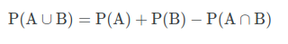
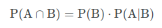

# Learning Objectives

- What is probability?

    - Probability is the branch of mathematics concerning numerical descriptions of how likely an event is to occur, or how likely it is that a proposition is true.

- Basic probability notation

    - P(A) refers to the probability that event A will occur.
    - P(A|B) refers to the conditional probability that event A occurs, given that event B has occurred.
    - P(A') refers to the probability of the complement of event A.
    - P(A ∩ B) refers to the probability of the intersection of events A and B.
    - P(A ∪ B) refers to the probability of the union of events A and B.

    

- What is independence? What is disjoint?

    - Independence: Two random variables are independent if the realization of one does not affect the probability distribution of the other.
    - Disjoint: Two sets are said to be disjoint sets if they have no element in common

- What is a union? intersection?

    - In set theory, the union (denoted by ∪) of a collection of sets is the set of all elements in the collection.
    
    - In mathematics, the intersection of two sets A and B , denoted by A ∩ B , is the set containing all elements of A that also belong to B.
    
- What are the general addition and multiplication rules?

    - The addition rule states the probability of two events is the sum of the probability that either will happen minus the probability that both will happen.
    
    - The multiplication rule states that the probability that A and B both occur is equal to the probability that B occurs times the conditional probability that A occurs given that B occurs.
    

- What is a probability distribution?

    - A probability distribution is a statistical function that describes all the possible values and likelihoods that a random variable can take within a given range. 

- What is a probability distribution function? probability mass function?

    - A probability distribution functionis a function whose value at any given sample (or point) in the sample space (the set of possible values taken by the random variable) can be interpreted as providing a relative likelihood that the value of the random variable would equal that sample.
    
- What is a cumulative distribution function?
- What is a percentile?
- What is mean, standard deviation, and variance?
- Common probability distributions
