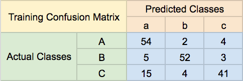
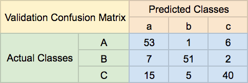

Given the following training and validation confusion matrices and the fact that human level performance has an error of ~14%, determine what the most important issue is and write the lettered answer in the file 6-compare_and_contrast

Most important issue:

A. High Bias
B. High Variance
C. Nothing
